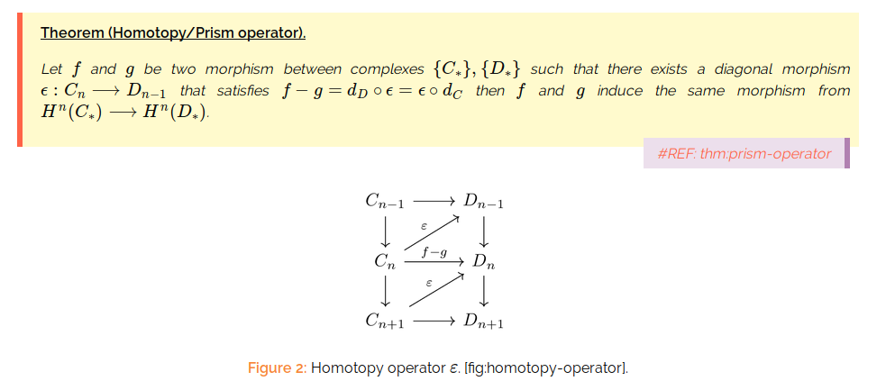

# theorems-css
CSS for theorem label and reference in org-publish


Usage
------
Emacs [org-publish](http://orgmode.org/manual/Publishing.html) export theorems (lemma, proposition,...etc) as customized blocks, i.e. inside
``` html
<div class="theorem"> </div>
```

The snippet in `/snippets/` add theorem title (attribute `btit`) and label (attribute `bid`) which also play the role of `id` attribute, e.g.
```html
<div btit="(Homotopy/Prism operator)" blab="thm:prism-operator" class="theorem">
```

The CSS file `theorems.css` customizes the HTML look.

Screenshoot
-----------
Since everyone loves screenshot, here is one.

